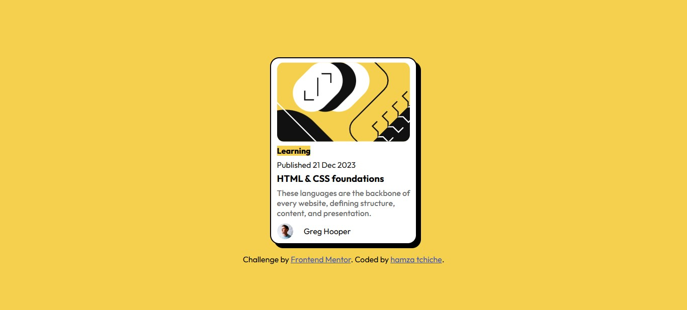
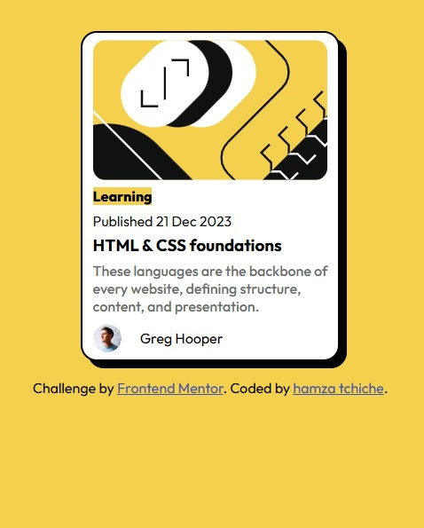

# Blog Preview Card

This is a solution to the **Blog Preview Card** challenge on [Frontend Mentor](https://www.frontendmentor.io). The goal is to build a responsive and visually engaging blog card using HTML and CSS, focusing on layout, typography, and hover effects.

## 🔗 Live Preview

You can view the live site [here](https://hamzatchiche.github.io/Blog-preview-card/index.html)
## 🛠️ Built With

- HTML5
- CSS3
- Custom properties (CSS variables)
- Google Fonts (Figtree & Outfit)
- Flexbox
- Hover effects and transitions

## ✨ Features

- Fully responsive card component
- Custom hover animations for image, tag, and avatar
- Clean and semantic HTML structure
- Accessible and minimalist design

## 📁 Folder Structure

project-folder/
├── assets/
│ ├── fonts/
│ └── images/
│ ├── favicon-32x32.png
│ ├── illustration-article.svg
│ └── image-avatar.webp
├── index.html
└── README.md

## 📸 Screenshots

| Desktop                        | Mobile                         |
|-------------------------------|--------------------------------|
|  |  |

## 👨‍💻 Author

- GitHub: [@Hamza Tchiche](https://github.com/hamzatchiche)
- Frontend Mentor: [@Hamza Tchiche](https://www.frontendmentor.io/profile/hamzatchiche)

## 📝 License

This project is licensed under the MIT License — feel free to use and modify it.

---

> Challenge by [Frontend Mentor](https://www.frontendmentor.io) | Coded by **Hamza Tchiche**
